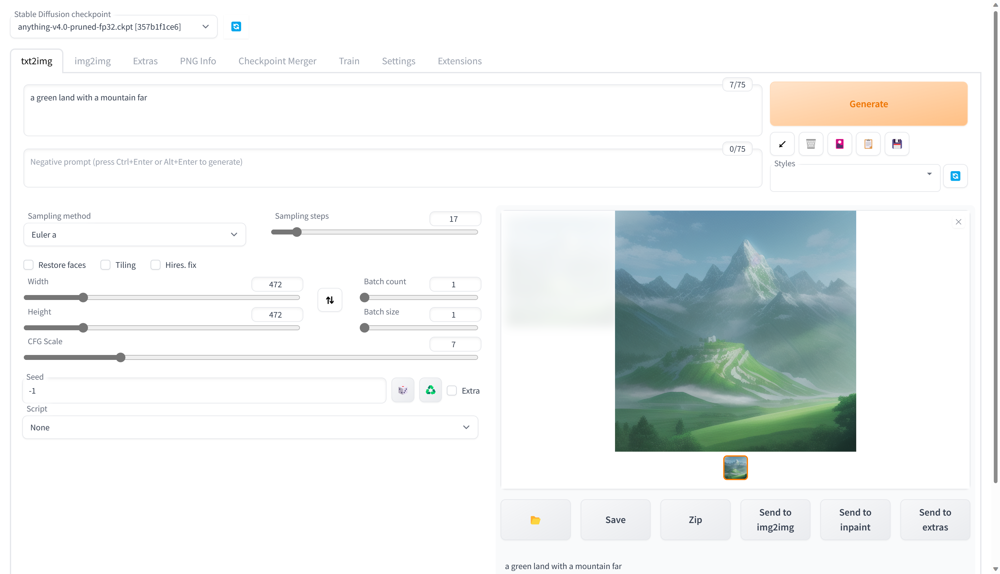
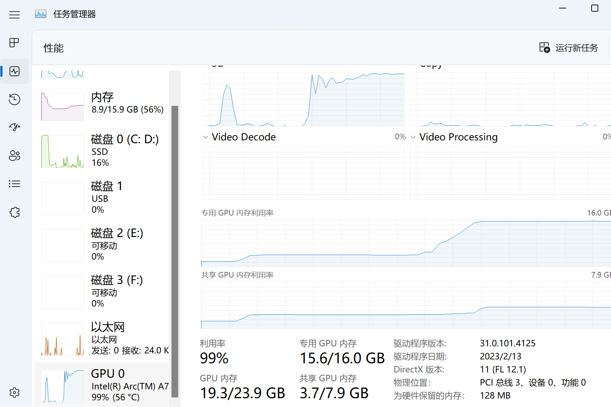

# Stable Diffusion web UI for Intel Arc with DirectML
Forked from [lshqqytiger/stable-diffusion-webui-directml](https://github.com/lshqqytiger/stable-diffusion-webui-directml). 该代码仅针对英特尔Arc GPU的报告错误进行了微调。  
**关于在Linux中使用IPEX（Intel Extensions for Pytorch）的SD，见这里。[Aloereed/stable-diffusion-webui-ipex-arc](https://github.com/Aloereed/stable-diffusion-webui-ipex-arc) 。这种方法使用较少的显存，生成较大的图像，并减少英特尔显卡在处理过程中的啸叫.**  

这个资源库只是为了记录一个经过验证可以用于Intel Arc GPU的webui版本（以及非常非常小的代码调整）。要获得最新的webui功能，你可以直接查看[这里](https://github.com/lshqqytiger/stable-diffusion-webui-directml)。
## 要求
+ 英特尔Arc GPU和最新的图形处理驱动。
+ Windows 11 64位
+ 一个Python环境
  
如果你使用的是nVidia GPU，你可以[到这里](https://github.com/AUTOMATIC1111/stable-diffusion-webui)。AMD GPU [这里](https://github.com/lshqqytiger/stable-diffusion-webui-directml)。 

## 测试环境
+ Intel Arc A770 16G
+ 驱动程序。31.0.101.4125
+ Windows 11 22H2
+ 模型：anything-v4.0-pruned-fp32（然而在fp16中运行）。

一个基于Gradio库的浏览器界面，用于SD。

  



## 问题
+ 你应该生成512x512以内的图像。512x512可能是一个临界点，即使对于A770 16GB来说。或者你可以尝试在webui-user.bat中 "set COMMANDLINE_ARGS= --opt-sub-quad-attention --lowvram --disable-nan-check"，但速度会慢很多。A380/A750也应该试试这一行。
+ 同样的情况到Hires.fix
+ 如果你的电脑上有多个DirectML设备，你可能需要检查[这里](https://github.com/lshqqytiger/stable-diffusion-webui-directml)。或者修改[modules/devices.py](modules/devices.py)。
## 设置
只需运行webui-user.bat。请确保以下仓库被下载。(包括 BLIP, CodeFromer, [k-diffusion](https://github.com/lshqqytiger/k-diffusion-directml/tree/891466a373cef42ce7ac3dd840dbba6d832b024b), [stable-diffusion-stability-ai](https://github.com/lshqqytiger/stablediffusion-directml/tree/890e30734bece57c05ed6849c9453359c3511844),taming-transformes)  

## Features
[Detailed feature showcase with images](https://github.com/AUTOMATIC1111/stable-diffusion-webui/wiki/Features):
- Original txt2img and img2img modes
- One click install and run script (but you still must install python and git)
- Outpainting
- Inpainting
- Color Sketch
- Prompt Matrix
- Stable Diffusion Upscale
- Attention, specify parts of text that the model should pay more attention to
    - a man in a ((tuxedo)) - will pay more attention to tuxedo
    - a man in a (tuxedo:1.21) - alternative syntax
    - select text and press ctrl+up or ctrl+down to automatically adjust attention to selected text (code contributed by anonymous user)
- Loopback, run img2img processing multiple times
- X/Y/Z plot, a way to draw a 3 dimensional plot of images with different parameters
- Textual Inversion
    - have as many embeddings as you want and use any names you like for them
    - use multiple embeddings with different numbers of vectors per token
    - works with half precision floating point numbers
    - train embeddings on 8GB (also reports of 6GB working)
- Extras tab with:
    - GFPGAN, neural network that fixes faces
    - CodeFormer, face restoration tool as an alternative to GFPGAN
    - RealESRGAN, neural network upscaler
    - ESRGAN, neural network upscaler with a lot of third party models
    - SwinIR and Swin2SR([see here](https://github.com/AUTOMATIC1111/stable-diffusion-webui/pull/2092)), neural network upscalers
    - LDSR, Latent diffusion super resolution upscaling
- Resizing aspect ratio options
- Sampling method selection
    - Adjust sampler eta values (noise multiplier)
    - More advanced noise setting options
- Interrupt processing at any time
- 4GB video card support (also reports of 2GB working)
- Correct seeds for batches
- Live prompt token length validation
- Generation parameters
     - parameters you used to generate images are saved with that image
     - in PNG chunks for PNG, in EXIF for JPEG
     - can drag the image to PNG info tab to restore generation parameters and automatically copy them into UI
     - can be disabled in settings
     - drag and drop an image/text-parameters to promptbox
- Read Generation Parameters Button, loads parameters in promptbox to UI
- Settings page
- Running arbitrary python code from UI (must run with --allow-code to enable)
- Mouseover hints for most UI elements
- Possible to change defaults/mix/max/step values for UI elements via text config
- Tiling support, a checkbox to create images that can be tiled like textures
- Progress bar and live image generation preview
    - Can use a separate neural network to produce previews with almost none VRAM or compute requirement
- Negative prompt, an extra text field that allows you to list what you don't want to see in generated image
- Styles, a way to save part of prompt and easily apply them via dropdown later
- Variations, a way to generate same image but with tiny differences
- Seed resizing, a way to generate same image but at slightly different resolution
- CLIP interrogator, a button that tries to guess prompt from an image
- Prompt Editing, a way to change prompt mid-generation, say to start making a watermelon and switch to anime girl midway
- Batch Processing, process a group of files using img2img
- Img2img Alternative, reverse Euler method of cross attention control
- Highres Fix, a convenience option to produce high resolution pictures in one click without usual distortions
- Reloading checkpoints on the fly
- Checkpoint Merger, a tab that allows you to merge up to 3 checkpoints into one
- [Custom scripts](https://github.com/AUTOMATIC1111/stable-diffusion-webui/wiki/Custom-Scripts) with many extensions from community
- [Composable-Diffusion](https://energy-based-model.github.io/Compositional-Visual-Generation-with-Composable-Diffusion-Models/), a way to use multiple prompts at once
     - separate prompts using uppercase `AND`
     - also supports weights for prompts: `a cat :1.2 AND a dog AND a penguin :2.2`
- No token limit for prompts (original stable diffusion lets you use up to 75 tokens)
- DeepDanbooru integration, creates danbooru style tags for anime prompts
- [xformers](https://github.com/AUTOMATIC1111/stable-diffusion-webui/wiki/Xformers), major speed increase for select cards: (add --xformers to commandline args)
- via extension: [History tab](https://github.com/yfszzx/stable-diffusion-webui-images-browser): view, direct and delete images conveniently within the UI
- Generate forever option
- Training tab
     - hypernetworks and embeddings options
     - Preprocessing images: cropping, mirroring, autotagging using BLIP or deepdanbooru (for anime)
- Clip skip
- Hypernetworks
- Loras (same as Hypernetworks but more pretty)
- A sparate UI where you can choose, with preview, which embeddings, hypernetworks or Loras to add to your prompt. 
- Can select to load a different VAE from settings screen
- Estimated completion time in progress bar
- API
- Support for dedicated [inpainting model](https://github.com/runwayml/stable-diffusion#inpainting-with-stable-diffusion) by RunwayML.
- via extension: [Aesthetic Gradients](https://github.com/AUTOMATIC1111/stable-diffusion-webui-aesthetic-gradients), a way to generate images with a specific aesthetic by using clip images embeds (implementation of [https://github.com/vicgalle/stable-diffusion-aesthetic-gradients](https://github.com/vicgalle/stable-diffusion-aesthetic-gradients))
- [Stable Diffusion 2.0](https://github.com/Stability-AI/stablediffusion) support - see [wiki](https://github.com/AUTOMATIC1111/stable-diffusion-webui/wiki/Features#stable-diffusion-20) for instructions
- [Alt-Diffusion](https://arxiv.org/abs/2211.06679) support - see [wiki](https://github.com/AUTOMATIC1111/stable-diffusion-webui/wiki/Features#alt-diffusion) for instructions
- Now without any bad letters!
- Load checkpoints in safetensors format
- Eased resolution restriction: generated image's domension must be a multiple of 8 rather than 64
- Now with a license!
- Reorder elements in the UI from settings screen
- 

## Installation and Running
Make sure the required [dependencies](https://github.com/AUTOMATIC1111/stable-diffusion-webui/wiki/Dependencies) are met and follow the instructions available for both [NVidia](https://github.com/AUTOMATIC1111/stable-diffusion-webui/wiki/Install-and-Run-on-NVidia-GPUs) (recommended) and [AMD/Intel](https://github.com/AUTOMATIC1111/stable-diffusion-webui/wiki/Install-and-Run-on-AMD-GPUs) GPUs.

Alternatively, use online services (like Google Colab):

- [List of Online Services](https://github.com/AUTOMATIC1111/stable-diffusion-webui/wiki/Online-Services)

### Automatic Installation on Windows
1. Install [Python 3.10.6](https://www.python.org/downloads/windows/), checking "Add Python to PATH"
2. Install [git](https://git-scm.com/download/win).
3. Download the stable-diffusion-webui repository, for example by running `git clone https://github.com/AUTOMATIC1111/stable-diffusion-webui.git`.
4. Place stable diffusion checkpoint (`model.ckpt`) in the `models/Stable-diffusion` directory (see [dependencies](https://github.com/AUTOMATIC1111/stable-diffusion-webui/wiki/Dependencies) for where to get it).
5. Run `webui-user.bat` from Windows Explorer as normal, non-administrator, user.

### Automatic Installation on Linux
1. Install the dependencies:
```bash
# Debian-based:
sudo apt install wget git python3 python3-venv
# Red Hat-based:
sudo dnf install wget git python3
# Arch-based:
sudo pacman -S wget git python3
```
2. To install in `/home/$(whoami)/stable-diffusion-webui/`, run:
```bash
bash <(wget -qO- https://raw.githubusercontent.com/AUTOMATIC1111/stable-diffusion-webui/master/webui.sh)
```

### Installation on Apple Silicon

Find the instructions [here](https://github.com/AUTOMATIC1111/stable-diffusion-webui/wiki/Installation-on-Apple-Silicon).

## Contributing
Here's how to add code to this repo: [Contributing](https://github.com/AUTOMATIC1111/stable-diffusion-webui/wiki/Contributing)

## Documentation
The documentation was moved from this README over to the project's [wiki](https://github.com/AUTOMATIC1111/stable-diffusion-webui/wiki).

## Credits
Licenses for borrowed code can be found in `Settings -> Licenses` screen, and also in `html/licenses.html` file.

- Stable Diffusion - https://github.com/CompVis/stable-diffusion, https://github.com/CompVis/taming-transformers
- k-diffusion - https://github.com/crowsonkb/k-diffusion.git
- GFPGAN - https://github.com/TencentARC/GFPGAN.git
- CodeFormer - https://github.com/sczhou/CodeFormer
- ESRGAN - https://github.com/xinntao/ESRGAN
- SwinIR - https://github.com/JingyunLiang/SwinIR
- Swin2SR - https://github.com/mv-lab/swin2sr
- LDSR - https://github.com/Hafiidz/latent-diffusion
- MiDaS - https://github.com/isl-org/MiDaS
- Ideas for optimizations - https://github.com/basujindal/stable-diffusion
- Cross Attention layer optimization - Doggettx - https://github.com/Doggettx/stable-diffusion, original idea for prompt editing.
- Cross Attention layer optimization - InvokeAI, lstein - https://github.com/invoke-ai/InvokeAI (originally http://github.com/lstein/stable-diffusion)
- Sub-quadratic Cross Attention layer optimization - Alex Birch (https://github.com/Birch-san/diffusers/pull/1), Amin Rezaei (https://github.com/AminRezaei0x443/memory-efficient-attention)
- Textual Inversion - Rinon Gal - https://github.com/rinongal/textual_inversion (we're not using his code, but we are using his ideas).
- Idea for SD upscale - https://github.com/jquesnelle/txt2imghd
- Noise generation for outpainting mk2 - https://github.com/parlance-zz/g-diffuser-bot
- CLIP interrogator idea and borrowing some code - https://github.com/pharmapsychotic/clip-interrogator
- Idea for Composable Diffusion - https://github.com/energy-based-model/Compositional-Visual-Generation-with-Composable-Diffusion-Models-PyTorch
- xformers - https://github.com/facebookresearch/xformers
- DeepDanbooru - interrogator for anime diffusers https://github.com/KichangKim/DeepDanbooru
- Sampling in float32 precision from a float16 UNet - marunine for the idea, Birch-san for the example Diffusers implementation (https://github.com/Birch-san/diffusers-play/tree/92feee6)
- Instruct pix2pix - Tim Brooks (star), Aleksander Holynski (star), Alexei A. Efros (no star) - https://github.com/timothybrooks/instruct-pix2pix
- Security advice - RyotaK
- Initial Gradio script - posted on 4chan by an Anonymous user. Thank you Anonymous user.
- (You)
